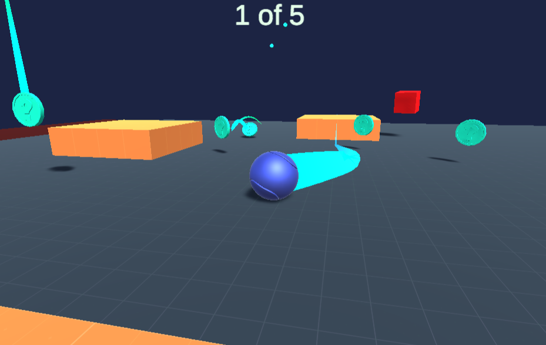
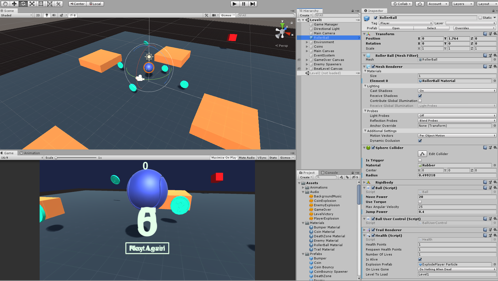

# RollerMadnessWebGL
WebGL build of a miniproject whose goal was to learn how to create a basic game with Unity3D.

Working WebGL liveapp can be found [here](https://romxz-rollermadnesswebgl.glitch.me/). Based on the week 3 miniproject of [this](https://www.coursera.org/learn/game-development) course on GameDev with Unity.

